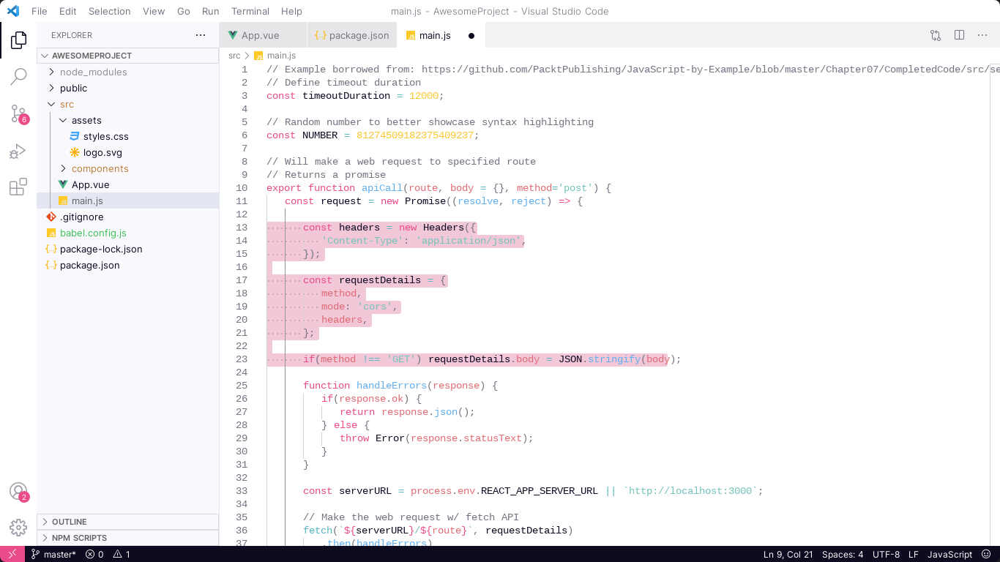
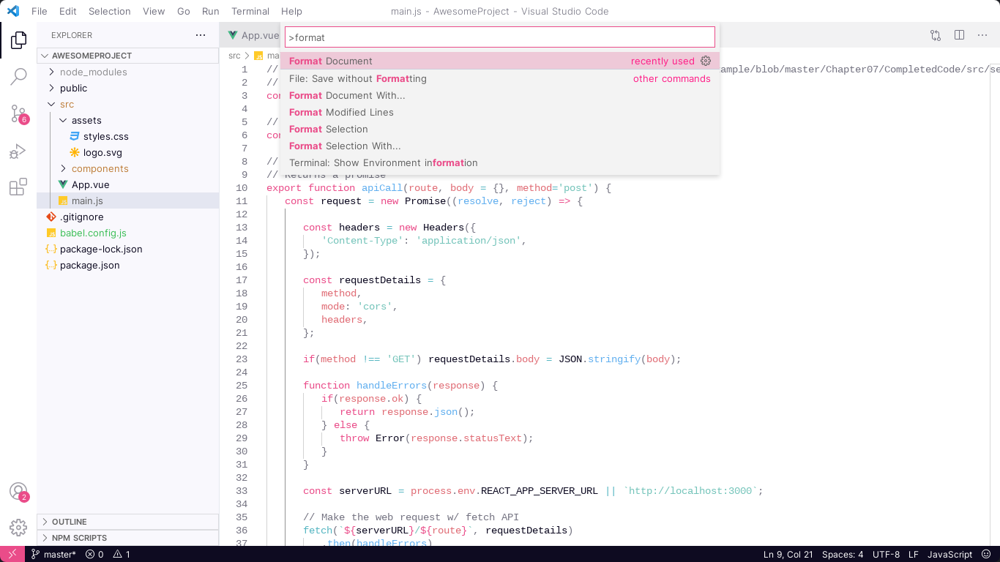
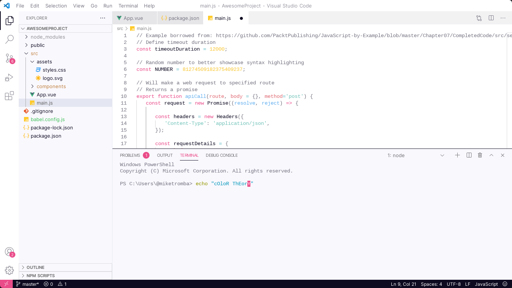

<h1 style="display:flex;align-items:center;gap:1rem;">
    
    Dribbble Theme
</h1>
<div>
    
    
    
    
</div>
<br />
<br />
<div style="display:flex;flex-direction:column;gap:2rem;align-items:center;">
    
    <p>A lightmode theme, based on the <a href="https://dribbble.com/">Dribbble</a> website.</p>
</div>
<br />
<br />
<br />



<br />
<h2>Install</h2>

```
1. Extensions ‣ Search for 'Dribbble Theme' ‣ Install
2. Command Palette ‣ Dribble Theme: select theme
```